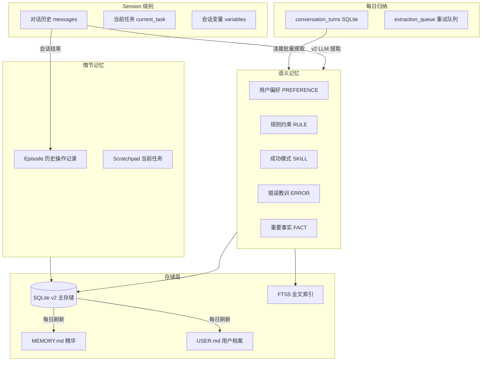
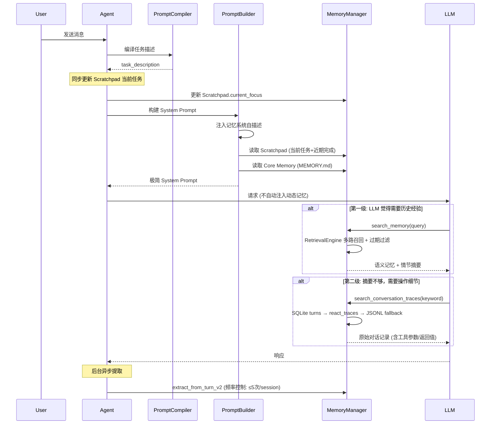
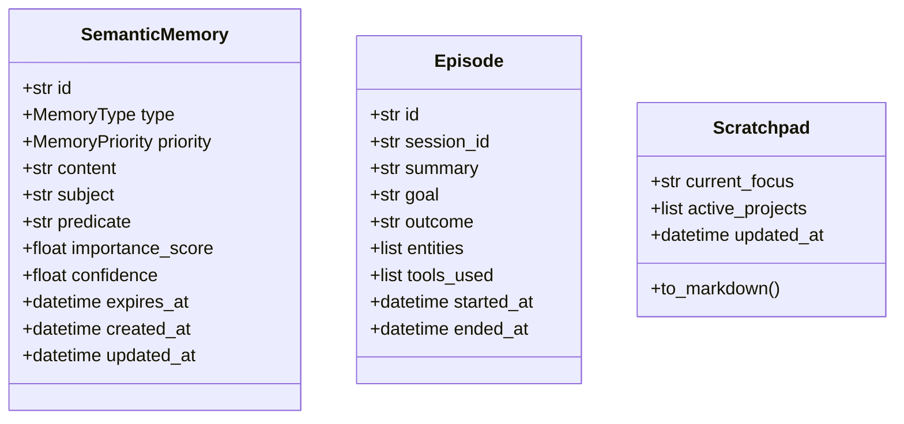
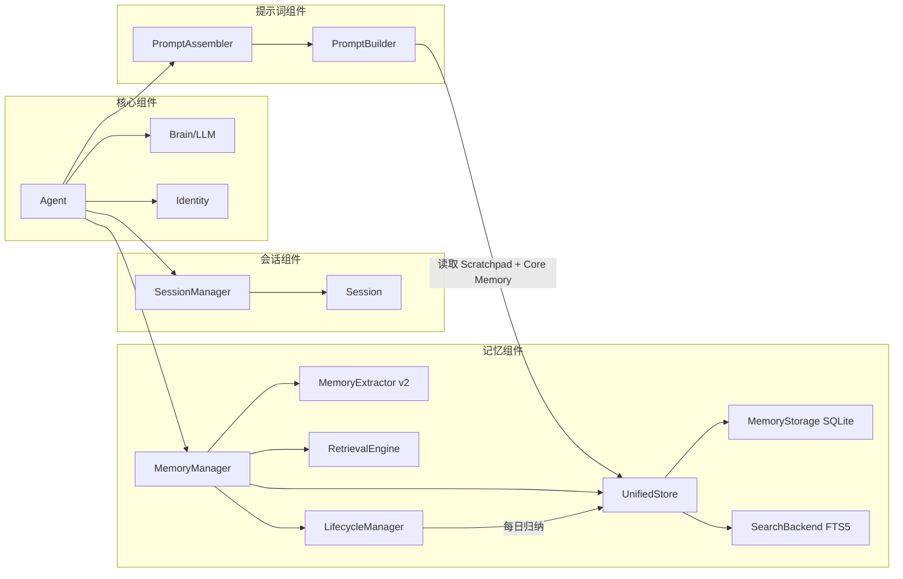
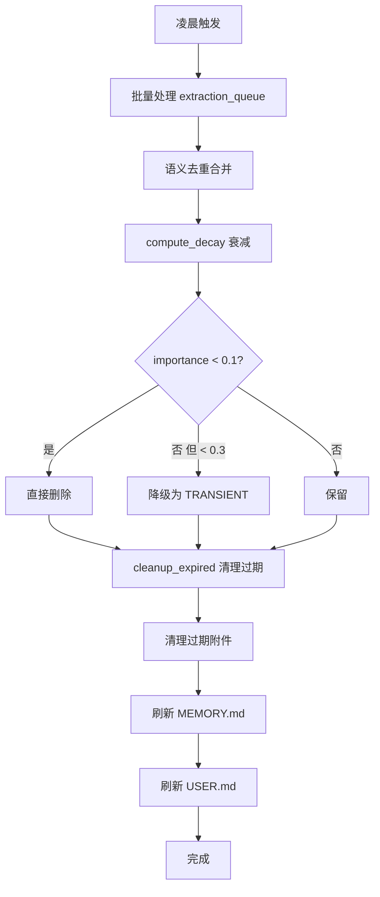

# 记忆系统架构

> 最后更新: 2026-02-23 (v2 架构)

## 一、整体架构



## 二、存储设计 (v2)

| 存储 | 用途 | 技术 | 更新频率 |
|------|------|------|----------|
| **memories 表** | 语义记忆主存储 | SQLite + FTS5 全文索引 | 实时（每轮提取） |
| **episodes 表** | 情节记忆（对话摘要） | SQLite | 会话结束时生成 |
| **scratchpad 表** | 工作记忆（当前任务） | SQLite | 每轮同步更新 |
| **conversation_turns 表** | 对话原文索引 | SQLite | 实时 |
| **extraction_queue 表** | 提取重试队列 | SQLite (UNIQUE去重) | 异步 |
| **MEMORY.md** | 核心记忆精华 | 文件 | 每日归纳 |
| **USER.md** | 用户档案 | 文件 | 每日归纳 |

## 三、数据流 — 渐进式披露



## 四、记忆类型

### 语义记忆 (SemanticMemory)



| 类型 | 说明 | 示例 | 默认保留 |
|------|------|------|----------|
| FACT | 事实信息 | "用户的代码目录在 D:\code" | 由 LLM 判断 |
| PREFERENCE | 用户偏好 | "用户喜欢用 Python" | permanent |
| SKILL | 成功模式 | "用 pytest 测试更可靠" | permanent |
| ERROR | 错误教训 | "直接删除文件会导致数据丢失" | 7d |
| RULE | 规则约束 | "禁止虚报执行结果" | 24h (任务规则) / permanent (行为规则) |

### 保留时长机制 (expires_at)

| 优先级 | 保留时长 | 实现方式 |
|--------|----------|----------|
| TRANSIENT | 1 天 | `expires_at = now + 1d`，`end_session` 时清理 |
| SHORT_TERM | 3 天 | `expires_at = now + 3d`，`compute_decay` 低分直接删除 |
| LONG_TERM | 30 天 | `expires_at = now + 30d` |
| PERMANENT | 永不删除 | `expires_at = None` |

v2 提取时 LLM 输出 `duration` 字段 (`permanent|7d|24h|session`)，映射为 `expires_at`。

### 情节记忆 (Episode)

会话结束时由 LLM 生成的交互摘要，包含目标、结果、使用的工具、涉及的实体。
在 `to_markdown()` 中以 "历史操作记录" 标签展示。
不再自动注入 system prompt，仅在 LLM 调用 `search_memory` 时按实体匹配返回。

### 工作记忆 (Scratchpad)

由 compiler `task_description` 驱动的结构化任务状态：
- **当前任务**: 来自 compiler 输出，每轮同步更新
- **近期完成**: 话题切换时自动归档旧任务（带时间戳，最多 5 条）

不再由 LLM 自由生成，`SCRATCHPAD_PROMPT` 已废弃。

## 五、组件关系



## 六、提取与注入策略

### 提取策略 (写入端)

| 触发时机 | 方式 | 频率控制 |
|----------|------|----------|
| 用户消息 | `extract_from_turn_v2` (LLM) | ≤5 次/session，≥30 字符 |
| 会话结束 | `generate_episode` (LLM) | 每次会话 1 次 |
| 上下文压缩 | 入队 `extraction_queue` | 去重 (UNIQUE) |
| 凌晨归纳 | `process_unextracted_turns` | 批量处理未提取轮次 |

`extract_quick_facts` (关键词匹配) 已废弃，所有提取由 v2 LLM 完成。

### 注入策略 (读取端) — 渐进式披露

System Prompt 只注入极简信息：
1. **记忆系统自描述** — 告知 LLM 两级搜索机制和使用时机
2. **Scratchpad** — 当前任务 + 近期完成
3. **Core Memory** — MEMORY.md 用户基本信息 + 永久规则

动态记忆 **不再自动注入**，由 LLM 按需两级搜索：

| 级别 | 工具 | 数据源 | 适合场景 |
|------|------|--------|----------|
| 第一级 | `search_memory` | RetrievalEngine 多路召回 → SQLite FTS5 fallback | 偏好/规则/经验/操作摘要 |
| 第二级 | `search_conversation_traces` | SQLite turns → react_traces → JSONL | 操作细节（工具参数、返回值原文） |

检索流程均包含过期记忆过滤 (`expires_at < now()` 自动排除)。

## 七、每日归纳流程



## 八、数据目录结构

```
data/memory/
├── memory.db                  # SQLite v2 主存储
│   ├── memories              # 语义记忆 (+ FTS5 索引)
│   ├── episodes              # 情节记忆
│   ├── scratchpad            # 工作记忆
│   ├── conversation_turns    # 对话原文
│   ├── extraction_queue      # 提取重试队列
│   └── attachments           # 文件/媒体记忆
├── memories.json              # v1 兼容（逐步淘汰）
├── conversation_history/      # 原始对话历史 JSONL
│   └── {session_id}.jsonl
└── daily_summaries/           # 每日归纳摘要

identity/
├── MEMORY.md                  # 核心记忆精华
└── USER.md                    # 用户档案（自动生成）
```

## 九、关键文件

| 文件 | 说明 |
|------|------|
| `memory/manager.py` | 记忆管理器，核心协调（提取+保存+检索入口） |
| `memory/storage.py` | SQLite 存储层 (DDL + CRUD) |
| `memory/unified_store.py` | 统一存储封装 (storage + search) |
| `memory/extractor.py` | v2 LLM 提取器 (含 Episode/Scratchpad) |
| `memory/retrieval.py` | 多路召回 + 重排序引擎 |
| `memory/lifecycle.py` | 每日归纳、衰减、清理 |
| `memory/types.py` | SemanticMemory / Episode / Scratchpad 类型定义 |
| `prompt/builder.py` | System Prompt 组装（渐进式披露） |
| `sessions/session.py` | Session 管理（截断摘要优化） |
| `core/agent.py` | Agent 主流程（话题检测 + Scratchpad 同步） |
